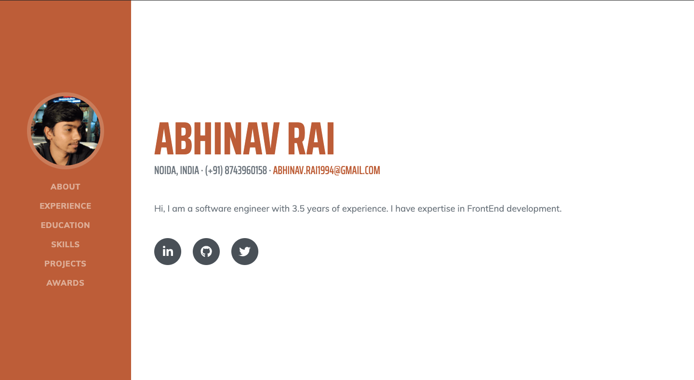

## My Portfolio

Created **React** based basic portfolio. A free template built with Bootstrap was used. 

<center>
<a href="https://abhinavrai23.github.io">
	
</a>
</center>
<br>
<br>

### If you want to use the same template:- 
* Fork the repo
* change image from `./src/images/profile.webp`
* update `data.json` from `./src/data.json`

### Steps to publish any HTML-based project

To publish your own **React-app**, follow these steps:-

* Keep in mind your repository name should be `<your-username>.github.io`
* Create your react based website.
* create a script for production build, like

	> ``` build: webpack --progress --profile ```
* install `gh-pages` npm package and add two commands in your `package.json`

   * `"predeploy": "npm run build"`

   * `"deploy": "NODE_DEBUG=gh-pages gh-pages -d dist"`

* To publish run `npm run deploy` command. It will create a new git branch that contains only the final build code.
* Now go to your repo's GitHub
	> `settings => Github Pages => Source branch => gh-pages`

* Visit your website (It may take some time to publish)
